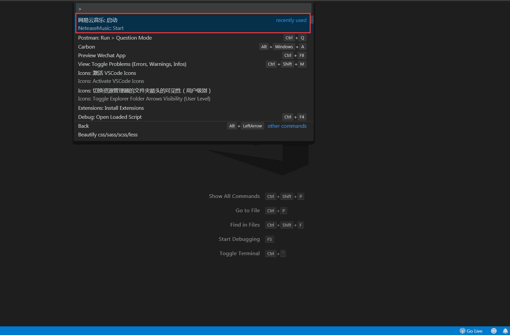
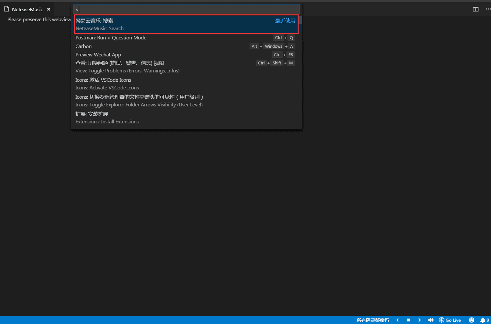
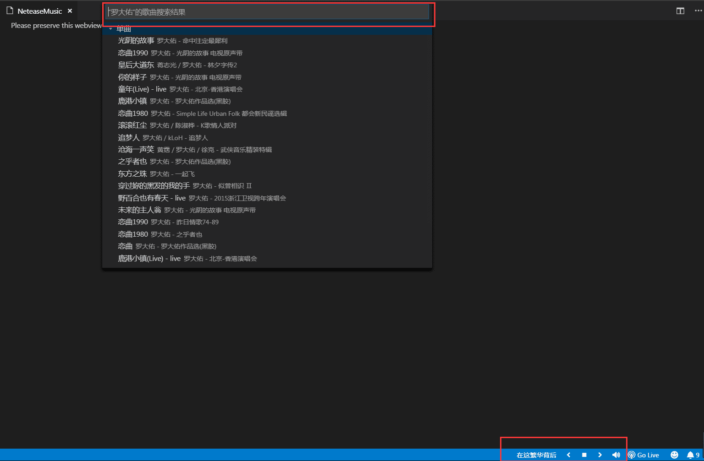

### 2019.03.05  VSCode 网易云音乐扩展

https://github.com/nondanee/vsc-netease-music

一边敲代码，一边看歌词听音乐的感觉确实不错~  这工具挺有新意

> 插件启动

> 歌单搜索

> 搜索列表/播放

### 博文书写时需注意

在写博客文章时最好截图，录制一个动图，这样效果更为直观。我们写博客的目的不是只为了让我们自己看，更多的是让别人看。